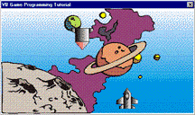



## \_a simple game programming tutorial

### Description

Transparent sprite animation over background. A collision detection (COLLIDE.BAS) module/engine which will make collision detection more easier.
 
### More Info
 

             |
---                |---
**Submitted On**   |2000-04-03 02:02:12
**By**             |[martin castañeda](https://github.com/Planet-Source-Code/PSCIndex/blob/master/ByAuthor/martin-casta-eda.md)
**Level**          |Beginner
**User Rating**    |2.8 (14 globes from 5 users)
**Compatibility**  |VB 3\.0, VB 4\.0 \(16\-bit\)
**Category**       |[Games](https://github.com/Planet-Source-Code/PSCIndex/blob/master/ByCategory/games__1-38.md)
**World**          |[Visual Basic](https://github.com/Planet-Source-Code/PSCIndex/blob/master/ByWorld/visual-basic.md)
**Archive File**   |[CODE\_UPLOAD1746\.zip](https://github.com/Planet-Source-Code/martin-casta-eda-a-simple-game-programming-tutorial__1-4388/archive/master.zip)

